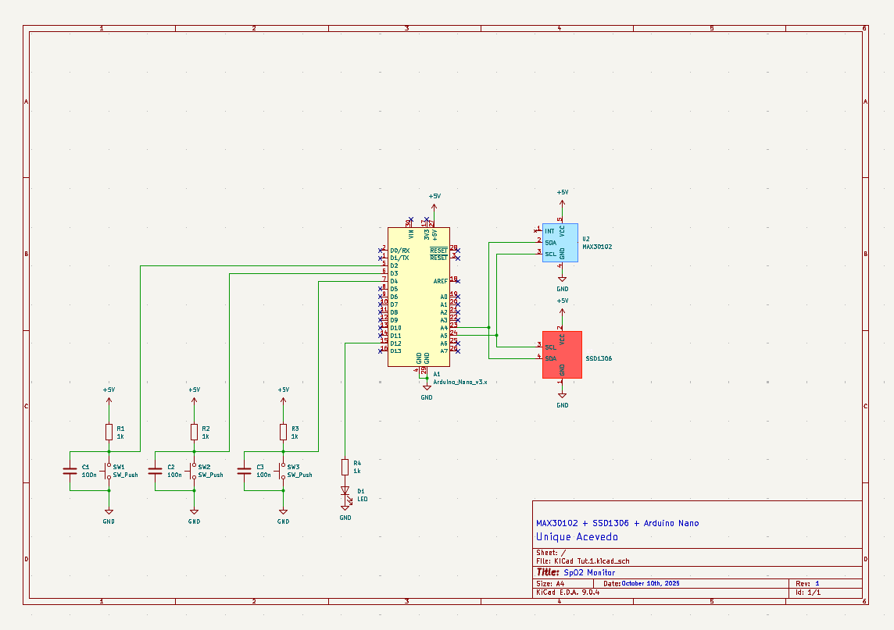
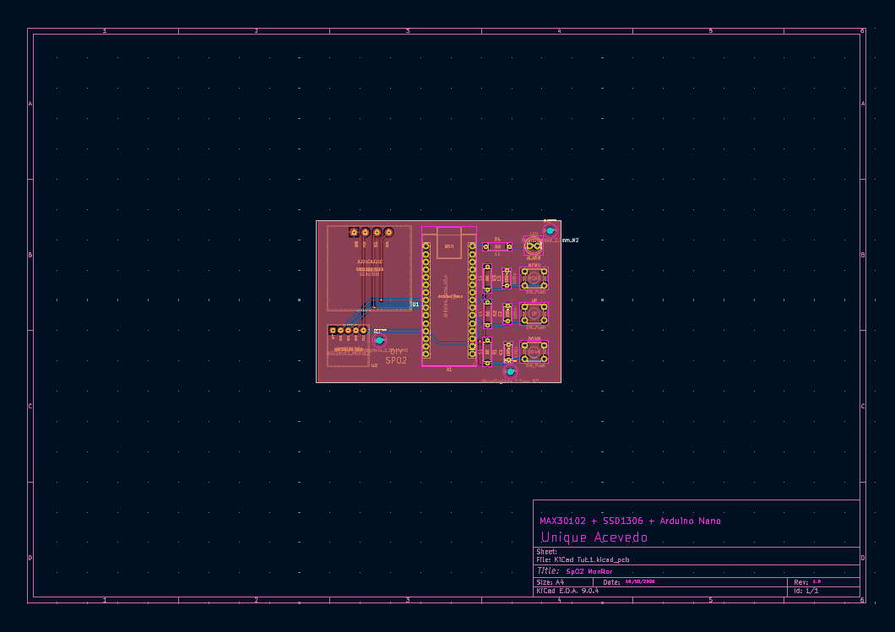
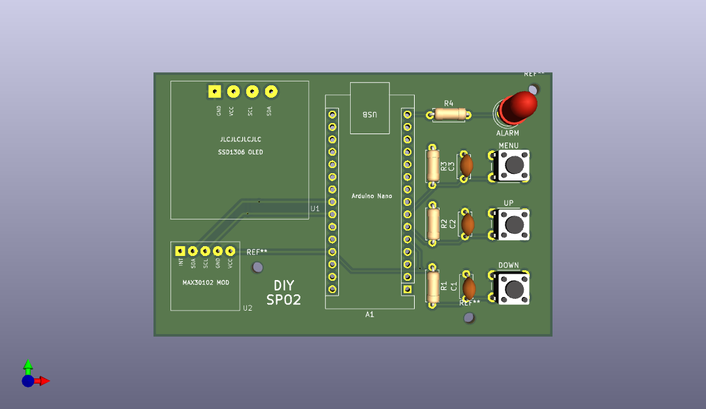
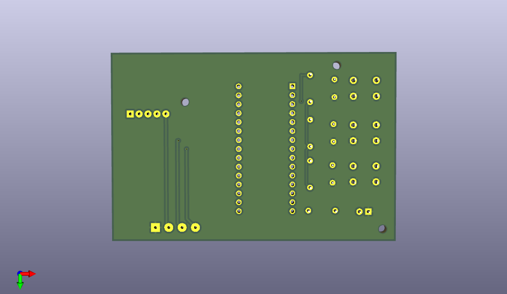

# SpO₂ Monitor (MAX30102 + SSD1306 + Arduino Nano)

A compact pulse-oximeter PCB integrating the MAX30102 optical sensor, SSD1306 OLED display, and Arduino Nano.  
Designed in KiCad as a fully custom board with self-made footprints and attention to routing precision, via placement, and trace impedance.  
The system measures heart rate and blood-oxygen levels and displays them on the onboard OLED.  

---

## Features
- Custom-designed footprints for MAX30102 and SSD1306 modules  
- 2-layer PCB designed and routed in KiCad  
- Shared I²C interface for MAX30102 and OLED display  
- Three tactile switches (Menu, Up, Down) for user navigation  
- Status LED indicator for measurement state  
- Clean routing with controlled trace widths and optimized via placement  
- USB-powered through Arduino Nano (5 V to regulated 3.3 V rail for sensor and display)  
- Compact layout and manufacturable with JLCPCB constraints  

---

## Schematic

  

---

## PCB Layout

  

---

## 3D Renders

  

  

---

## Design Summary
The board is centered around the Arduino Nano as the main controller.  
The MAX30102 module handles photoplethysmography (PPG) measurements through its internal red and infrared LEDs and photodiode.  
The SSD1306 OLED display provides real-time feedback of heart rate (BPM) and blood-oxygen percentage (SpO₂).  
All peripherals communicate via I²C, routed with short traces and minimal crosstalk to maintain signal stability.  

Custom footprints were designed in KiCad for both the MAX30102 and SSD1306 to ensure accurate mechanical fit and pad alignment.  
Trace widths were selected to balance manufacturability with low-impedance connections, and vias were strategically placed to maintain solid ground continuity across both layers.  
Power distribution follows a simple topology from USB 5 V → onboard regulator 3.3 V → sensor and display rails.  

---

## Skills Demonstrated
- PCB layout and routing in KiCad (2-layer)  
- Component footprint and symbol creation  
- Via stitching and ground-plane design  
- Trace-width and impedance awareness for I²C routing  
- Schematic capture and ERC/DRC verification  
- Board preparation for fabrication (Gerber generation, BOM management)  

---

## File Formats
- **KiCad_files/** – Editable schematic (`.kicad_sch`) and PCB layout (`.kicad_pcb`)  
- **exports/** – Rendered schematic and board images  
- **BOM/** – Component list for sourcing (JLC compatible)  
- **Gerbers/** – Manufacturing files (`.zip`) ready for upload to JLCPCB  
- **libraries/** – Custom KiCad symbols and footprints for MAX30102 and SSD1306  

---
