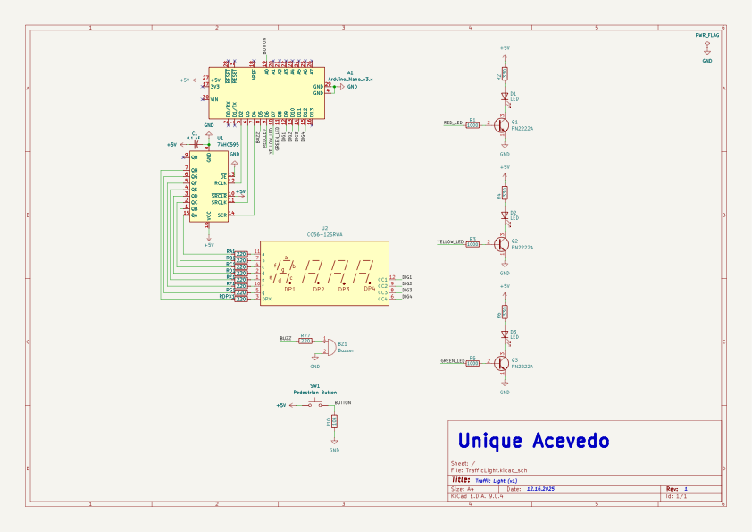
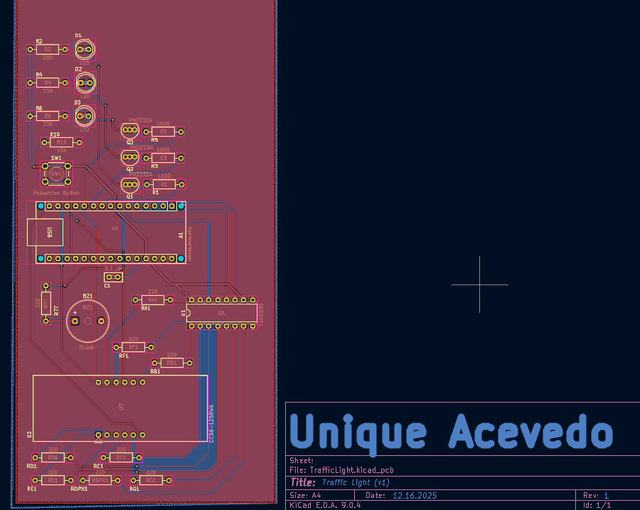
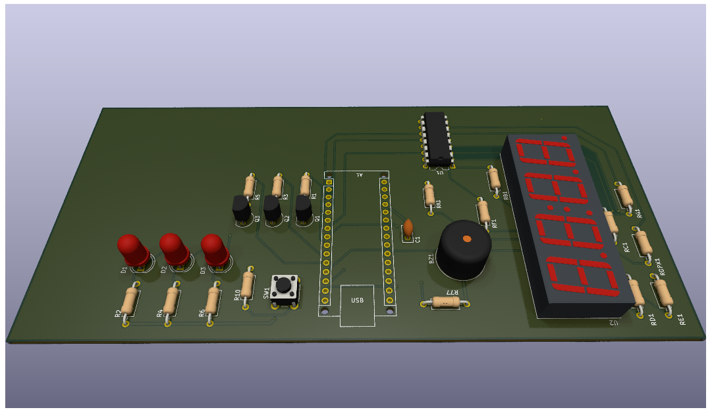
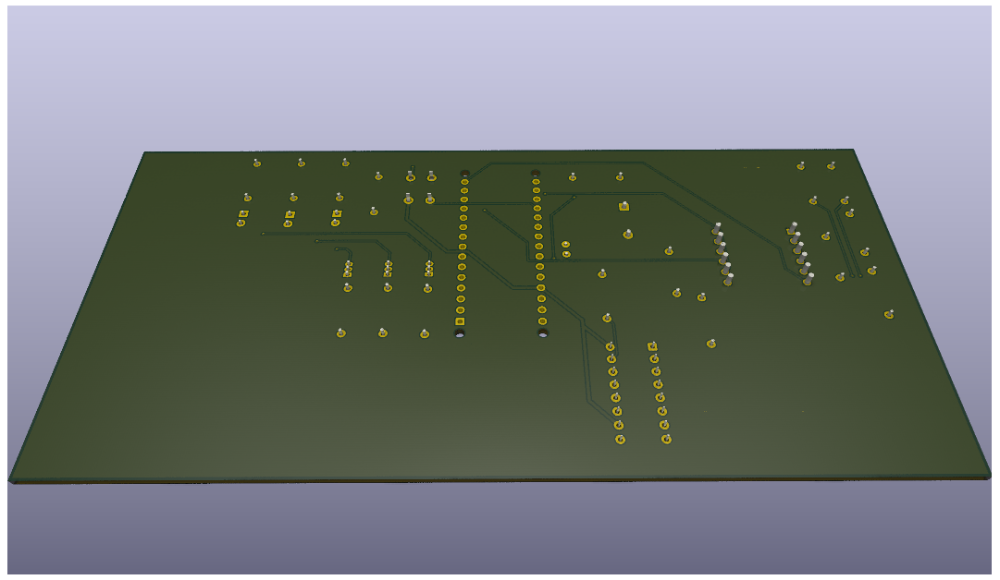

# 🚦 Traffic Light Controller — PCB Edition (v1)

### Overview
This project began as a **breadboard prototype** — a fully functional traffic light controller built using an **Arduino Nano**, **74HC595 shift register**, **PN2222A transistors**, and a **4-digit 7-segment display**.  
After validating the circuit in real hardware, I translated the same design into **KiCad**, recreating every connection in PCB form while keeping the same component lineup and logic.  

The placement on this PCB intentionally mirrors my breadboard layout, but with cleaner routing and future expandability in mind.  
This board represents **Version 1** in an ongoing series (**v1 → v3**) as I continue testing, refining, and evolving the design with real-world feedback from the physical build.

---

## 🧠 Project Goals
The objective of this project was to transform a simple breadboard demonstration into a professional-grade PCB while preserving educational clarity.  
While a real traffic light system would obviously be much larger and operate at higher voltages, this circuit demonstrates the **core control logic** behind sequencing, timing, and pedestrian input — all in a safe, 5 V environment.

It’s designed to visually and audibly show how:
- Shift registers expand microcontroller outputs efficiently  
- Transistors act as current drivers for LEDs  
- Multiplexed 7-segment displays share common pins  
- Logic timing can emulate real intersection behavior  

---

## ⚙️ Components & Design Choices
| Component | Purpose | Reason for Choice |
|------------|----------|------------------|
| **Arduino Nano** | Main controller | Small, USB-programmable, easy to integrate |
| **74HC595 Shift Register** | Output expansion | Reduces required GPIO pins for 7-segment control |
| **4-Digit Display (CC56-12SRWA)** | Countdown timer | Clear timing visualization for each signal phase |
| **PN2222A Transistors** | LED drivers | Provide current amplification for each traffic LED |
| **LEDs (Red, Yellow, Green)** | Visual indicators | Represent stop, caution, and go states |
| **Buzzer** | Audible alert | Simulates pedestrian crossing sound |
| **Push Button** | Pedestrian input | Adds user interactivity for signal changes |
| **Resistors & Capacitor** | Biasing / noise filtering | Ensure clean logic operation and signal stability |

These parts were chosen for their accessibility, educational value, and simplicity when breadboarding and later transferring to PCB.

---

## 🧩 KiCad Implementation
The schematic and PCB were designed in **KiCad 9** on macOS.  
The board is **two-layer** with a full **bottom ground plane** and careful top-layer signal routing.

Key layout decisions:
- Top layer dedicated to logic and signal traces  
- Bottom layer used for ground pour and return paths  
- Each transistor placed close to its corresponding LED for short current loops  
- Display lines neatly routed from the shift register to minimize crosstalk  

---

## 🧱 Why the Board Has Empty Space
You’ll notice a large **unused section** on the right side of the PCB.  
This was left **intentionally** — it’s a **reserved expansion area** for future project versions (v2, v3, etc.).  

The extra board real estate provides:
- Room to **add a small LCD or OLED screen** for displaying timing data or system messages  
- Space for **additional components** such as sensors, power regulation circuits, or wireless modules (e.g., ESP32 add-on or Bluetooth interface)  
- Flexibility to mount screw terminals or headers for modular experiments  
- Mechanical room for mounting holes, standoffs, or labeling zones in later revisions  

By leaving that area blank, the PCB acts as both a functional circuit **and a platform for iteration** — ensuring that later designs can evolve without having to redesign the base layout from scratch.  

---

## 🚀 Development Path & Future Integration
This board marks the **first iteration** of a continuing project — a way to evolve from a simple breadboard experiment into a fully realized learning platform.  

Future versions may explore:
- Additional components or sensors (e.g., displays, communication modules, or power add-ons)
- Refining layout spacing and silkscreen organization
- Testing alternative components for improved performance or aesthetics
- Expanding functionality based on results from the real hardware

The idea isn’t to finalize this design but to **keep it adaptable**.  
Each new version will serve as a checkpoint in understanding real-world electronics design — from schematic thinking to PCB fabrication and iteration.

---

## 📸 Media Gallery

---

## 🧾 Schematic

  

---

## 🖼️ PCB Layout

  

---

## 🧱 3D Renders

  

  

---

## ⚙️ Breadboard Prototype

  

---

## 🔴🟡🟢 Fully Working Circuit

Even though the working demo video isn’t embedded directly here (the `.mov` file was too large for GitHub’s inline preview), it’s included in the [`exports`](./exports) folder as **TrafficLight_Working.mov** for anyone who wants to see the real-world behavior of the circuit.  

That clip demonstrates the full sequence — each LED (red, yellow, green) activates in timed intervals while the 7-segment display and buzzer respond exactly as intended, matching the schematic logic one-to-one.  
This working prototype served as proof that every connection and timing element on the PCB mirrored the original breadboard version.

*(All visuals are included in the `/Exports` folder for clear one-page viewing.)*

---

## 🧰 Tools Used
- **KiCad 9.0.4** — schematic capture, layout, Gerbers  
- **Arduino IDE** — firmware and testing  
- **MacBook M3 / macOS Sequoia** — design platform  
- **JLCPCB** *(optional)* — for fabrication and assembly  

---

## 💡 Design Philosophy
This project represents my approach to **iterative hardware design** — moving step-by-step from conceptual breadboard work to real manufacturable hardware.  

The combination of digital logic, analog driving, and visual indicators makes it an ideal test bench for:
- Learning PCB routing techniques  
- Understanding signal vs. power separation  
- Documenting version control for hardware  
- Preparing professional fabrication-ready designs  

The generous unused space isn’t waste — it’s **foresight**. It turns this board into a living platform where ideas can grow, components can be added, and design maturity can be tracked version by version.

---

### 🧾 License
Released under the **MIT License** — free to fork, modify, and learn from.

---

### 🔗 Author
**Unique Acevedo**  
Electrical Engineer | Hardware Designer  
[LinkedIn](https://linkedin.com/in/uniqueacevedo) • [GitHub](https://github.com/UniqueAcevedo)
